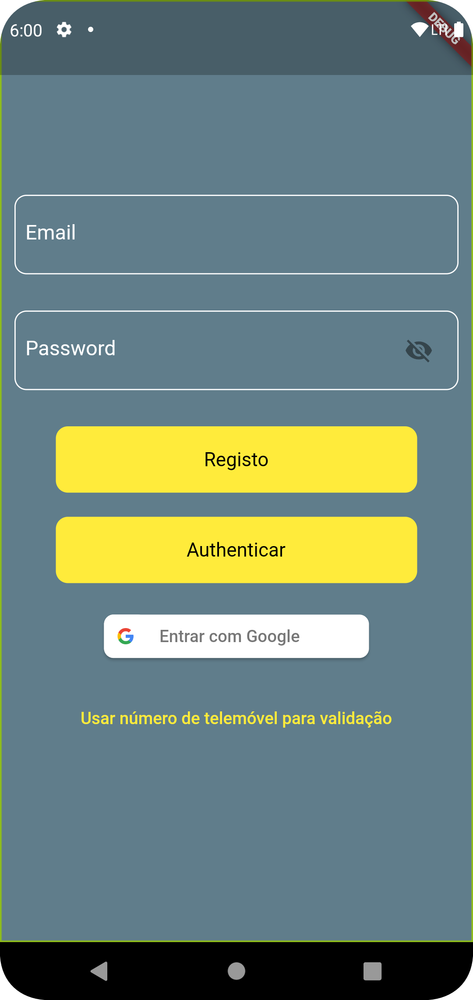
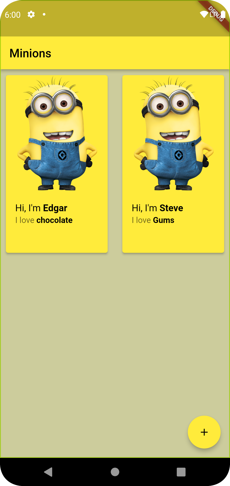
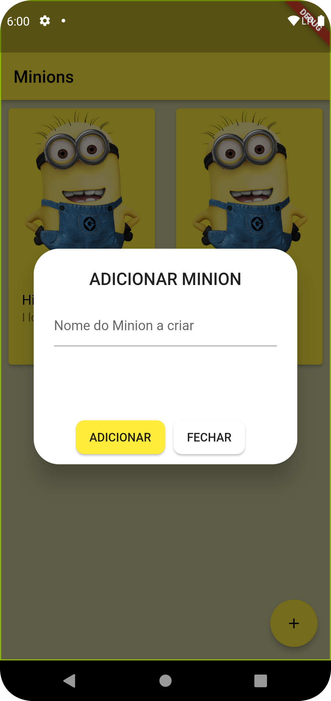

# flutterfire_demo

A demo application with the intent to explain Flutterfire concepts, combined with experimentation through practical examples.

## Points Covered
- Authentication
  - Google Sign In
  - Email/Password
- Cloud Firestore
- Cloud Firestore ODM

## Context

In order to make it a fun learning experience this app is built around the idea of a NFT gallery for Minions.

### Screenshots
- 
- 
- 

